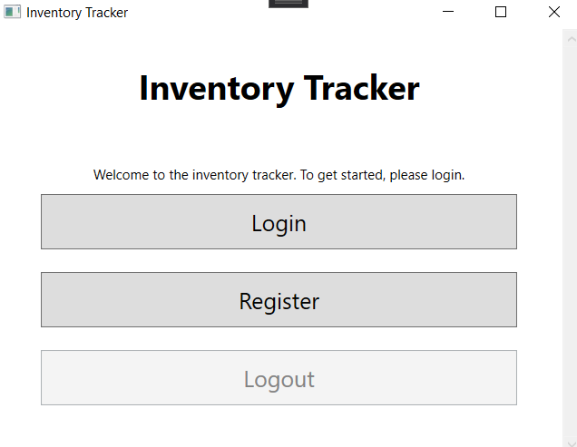
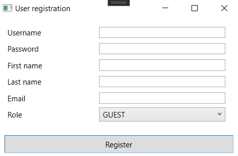
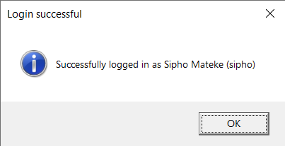
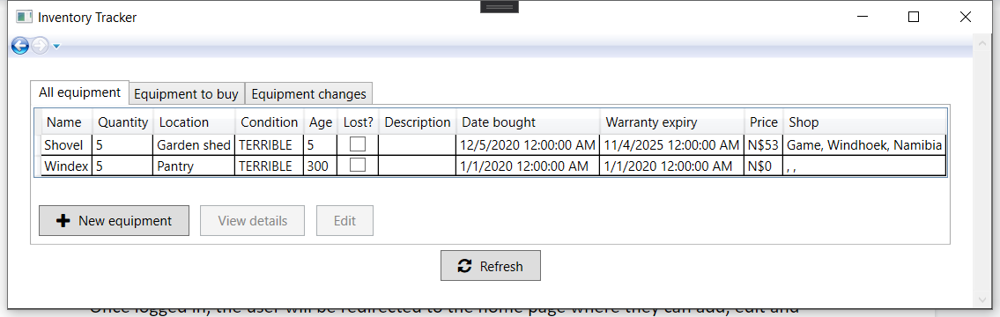
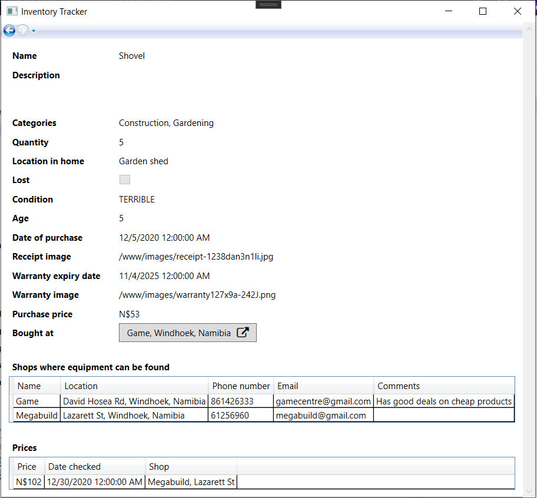
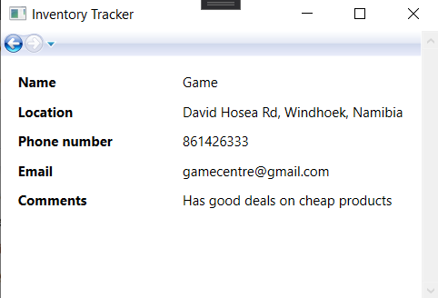
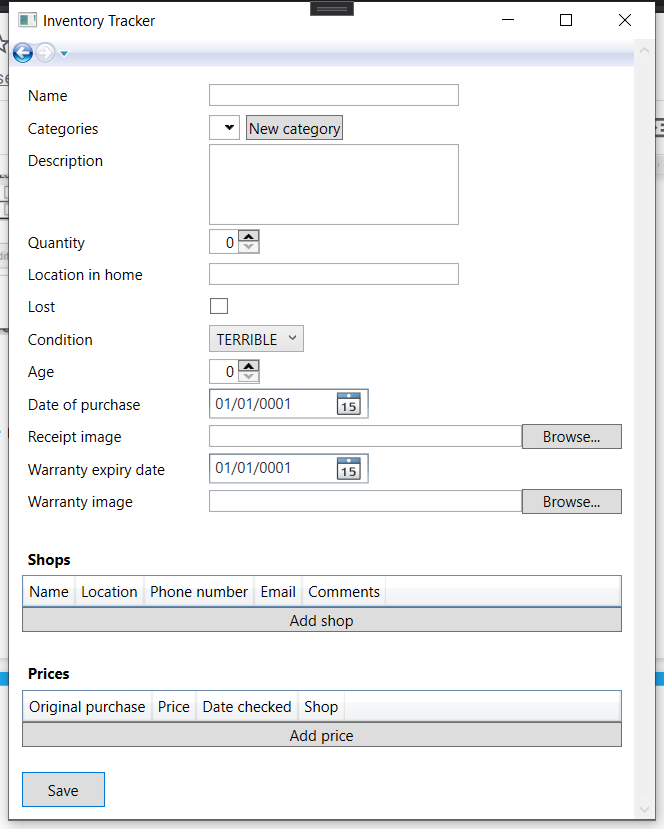
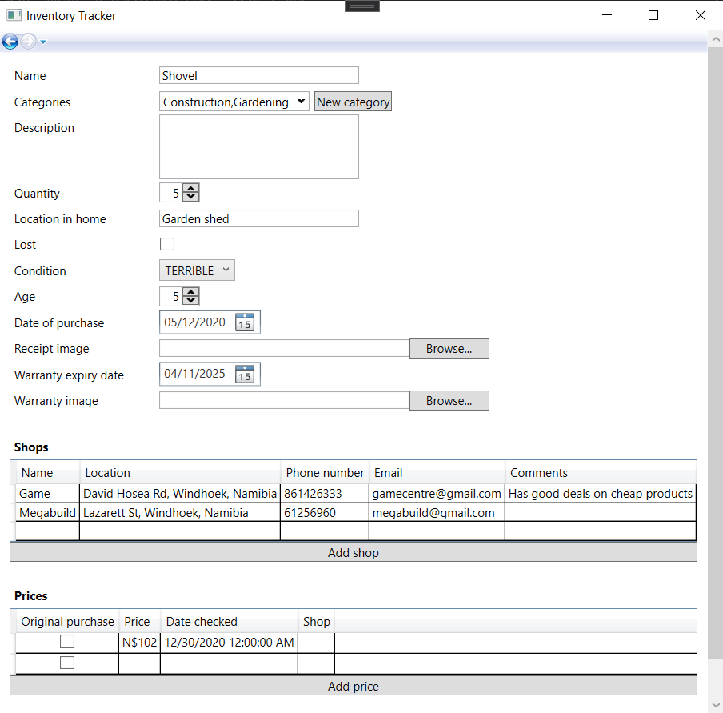
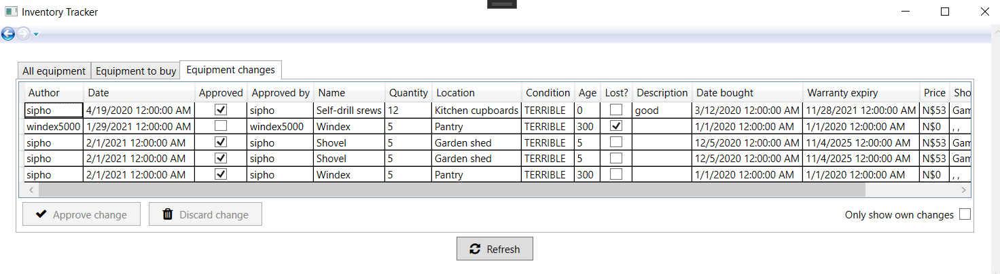
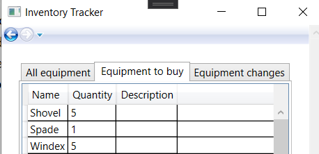

# NUST DPG621S - Inventory Tracker
Database created for a NUST DPG assignment to help a user track equipment in their home.

## User Manual
### System Requirements
- Windows 10
- Microsoft SQL Express Server
- .NET framework v4.7.2
- Visual Studio

### Installation
- First download and install Microsoft SQL Server Express edition.
- Then download the application itself from GitHub: https://github.com/siphomateke/NustDpgInventoryTracker
- Open the application in Visual Studio
- Publish the SQL server by double-clicking InventoryTrackerBackend.publish.xml in InventoryTrackerBackend.
- Then open and execute Script.PreDeployment.sql
- Finally, start the application by clicking the Start button.
- If you encounter any SQL-related errors, you may try running the provided Backup.sql file in the InventoryTrackerBackend folder.

### User accounts
Upon first starting the application, you are greeted with a window where you can either log in or register.

For the typical use case, the users will have been set up already, and you can simply log in. In case they haven’t, the admin of the system may press the register button and add new users. The admin will first be prompted for their login credentials, after which they can add all the new user’s details.

### Home page
Once logged in, you will be redirected to the home page where you can add, edit and view equipment as well as view which equipment needs to be bought.

### Viewing equipment
Under the “All equipment” tab on the home page, you can see all the equipment relevant to you. Not all users have permission to view all equipment, so you there may be more equipment available that you just don’t have permission to view. In the main table, you can view information about equipment such as name, location in home, quantity, age, date bought, shop bought at etc. However, more detailed information such as all available shops, prices at each shop and categories can only be viewed in the detailed equipment page. To access it, simply select the equipment you wish to know more about and press the “View details” button.

Examples of extra details that can be viewed only here is the phone number of the shop 
where the equipment was originally bought at. This can be viewed by pressing the button with the name of the shop next to “Bought at”.

Quick tip: The columns in the price and shop tables can be sorted by clicking on the headers. So if, for example, you wanted to see the shop with the cheapest price, you could simply click the price column in the prices table to sort the shops by price.
Adding equipment
To add new equipment, click the new equipment button. This will open the following screen.

From here, you may fill in all the details of the new equipment. Name, categories, description, quantity, location, shops, prices etc. Please note that it is important to choose the correct category as each user is only allowed to view certain categories.

### Editing equipment
To edit details about equipment, select the equipment you wish to modify and press the “Edit ” button. You will then be given hte option to edit details about the equipment including its name, categories, condition, age and date of purchase.

Once you are happy with your changes, press save. If you are an admin, your changes will automatically be applied and no further action is required. However, if you aren’t, your changes will need to first be approved by an admin before they apply to the master equipment data. You can view your pending changes in the “Equipment changes” tab on the homepage. 

Here you can see if your changes was approved and who it was approved by. You can also discard a change if you have changed your mind about it. If you are an admin, you will also be given the option to approve the changes by simply selecting one, and pressing the “Approve change” button.
### Equipment shopping list
The centre tab on the home page is the “Equipment to buy tab”. This tab shows all equipment that needs to be bought by the admin at some point. Equipment that are low on stock, completely out of stock or in terrible condition are all automatically added to this list.

## Known bugs
- Some equipment changes are accepted without approval such as categories and shop details.
- Warranty dates and dates of purchase are required when creating and editing equipment.
- Shops and prices can’t always be edited when editing equipment.

## Code structure
### InventoryTrackerFrontend
The frontend of the project was created as a C# WPF App utilizing the .NET framework. C# was chosen as it was most similar to Java which the group members were currently learning and WPF was chosen due to it being the most stable yet new UI framework for creating native Windows applications. WPF also had the advantage of having good support for SQL backends through libraries such as Dapper, which was utilized in this project.

### Folder structure:
- **Common** - Code applicable to all files
- **Models** - Data models that mirror the structure of various tables in the SQL backend.
- **UserControls** - Custom UI elements such as file pickers which are not natively implemented in WPF.
- **Views** - The various pages in the application containing UI-related code.
- **ViewModels** - Controllers for the views. These ViewModels contian the state of the application and drive most of the UI.

### InventoryTrackerBackend
The backend of the project was created using Microsoft SQL Express.

### Folder structure:
- **dbo** - All the SQL for the backend is stored here.
  - **Procedures** - Actual functionality of the backend such as getting list of users, which equipment users can view, adding new equipment, modifying equipment categories and much more.
  - **Tables** - The definitions for all the tables using in the backend.
  - **Triggers** - Triggers used to do things such as send notifications to admins when equipment details have changed and need approving.
  - **Views** - SQL views used to cache particular combinations of data.

## Closing remarks
Not all the functionality originally envisioned and outlined in the user requirements document could be implemented in the end due to the teams’ limited experience with the frontend software involved. .NET C# and WPF proved to be more challenging to work with than anticipated and so only the most important features were added. Additionally, several of the group members were uncooperative which caused further friction with the prototype’s development. However, almost all the required functionality was added to the backend server’s SQL and could be used to improve the frontend in the future. This additional backend SQL code is available in the “InventoryTrackerBackend” folder of the project.